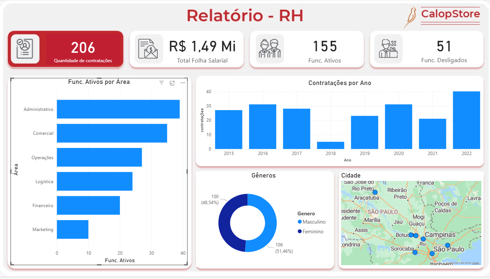

  

# 👥 Power BI – Dashboard de RH | CalopStore

Este projeto apresenta um dashboard de Recursos Humanos desenvolvido no Power BI, com base em uma tabela de funcionários da CalopStore. O foco foi transformar, modelar e analisar dados de forma clara, identificando padrões essenciais para decisões estratégicas de RH.

## 🔎 Objetivo do Projeto
Construir uma visão completa da força de trabalho, destacando contratações, desligamentos, distribuição por gênero, áreas, idade e custos de folha salarial.

## 🔧 Transformações no Power Query
Durante o processo de limpeza e preparação dos dados, foram aplicadas diversas etapas importantes:

- Renomeação da tabela e padronização das colunas  
- União de *Nome* + *Sobrenome* → **Nome Completo**  
- Identificação de funcionários **Ativos** e **Demitidos**  
- Padronização de gênero: **M → Masculino | F → Feminino**  
- Criação de coluna **Cidade**  
- Cálculo de **Gasto Salarial por funcionário**  
- Cálculo da **Idade** com base na data de nascimento  
- Uso de plano de fundo e personalização completa do tema

Essas etapas garantiram dados limpos, consistentes e prontos para análises mais profundas.

## 📐 Medidas DAX Criadas
O projeto incluiu a criação de medidas essenciais para leitura estratégica.
